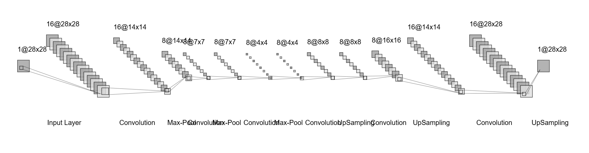

# Convolutional Autoencoder for Image Denoising

## AIM

To develop a convolutional autoencoder for image denoising application.

## Problem Statement and Dataset
An autoencoder is an unsupervised neural network that encodes input images into lower-dimensional representations and decodes them back, aiming for identical outputs. We use the MNIST dataset, consisting of 60,000 handwritten digits (28x28 pixels), to train a convolutional neural network for digit classification. The goal is to accurately classify each digit into one of 10 classes, from 0 to 9.

## Convolution Autoencoder Network Model

## DESIGN STEPS

### STEP 1:
Load the MNIST dataset and preprocess it by normalizing the pixel values to a range of 0 to 1. Then, add Gaussian noise to the dataset to create noisy images.

### STEP 2:
Build the autoencoder architecture using a series of convolutional and pooling layers for the encoder, followed by convolutional and upsampling layers for the decoder.

### STEP 3:
Compile the model with an appropriate loss function (binary_crossentropy) and optimizer (adam). Train the model using the noisy images as input and the original images as targets. Use the validation set to monitor the performance during training.


## PROGRAM
### Name:Shaik Shoaib Nawaz
### Register Number:212222240094
```
from tensorflow import keras
from tensorflow.keras import layers
from tensorflow.keras import utils
from tensorflow.keras import models
from tensorflow.keras.datasets import mnist
import numpy as np
import matplotlib.pyplot as plt
(x_train, _), (x_test, _) = mnist.load_data()
x_train.shape
x_train_scaled = x_train.astype('float32') / 255.
x_test_scaled = x_test.astype('float32') / 255.
x_train_scaled = np.reshape(x_train_scaled, (len(x_train_scaled), 28, 28, 1))
x_test_scaled = np.reshape(x_test_scaled, (len(x_test_scaled), 28, 28, 1))
noise_factor = 0.5
x_train_noisy = x_train_scaled + noise_factor * np.random.normal(loc=0.0, scale=1.0, size=x_train_scaled.shape) 
x_test_noisy = x_test_scaled + noise_factor * np.random.normal(loc=0.0, scale=1.0, size=x_test_scaled.shape) 

x_train_noisy = np.clip(x_train_noisy, 0., 1.)
x_test_noisy = np.clip(x_test_noisy, 0., 1.)
n = 10
plt.figure(figsize=(20, 2))
for i in range(1, n + 1):
    ax = plt.subplot(1, n, i)
    plt.imshow(x_test_noisy[i].reshape(28, 28))
    plt.gray()
    ax.get_xaxis().set_visible(False)
    ax.get_yaxis().set_visible(False)
plt.show()
input_img = keras.Input(shape=(28, 28, 1))

# Write your encoder here
x=layers.Conv2D(32, (3, 3), activation='relu', padding='same')(input_img)
x=layers.MaxPooling2D((2, 2), padding='same')(x)
x=layers.Conv2D(16, (3, 3), activation='relu', padding='same')(x)
x=layers.MaxPooling2D((2, 2), padding='same')(x)
x=layers.Conv2D(8, (3, 3), activation='relu', padding='same')(x)
encoded = layers.MaxPooling2D((2, 2), padding='same')(x)

# Encoder output dimension is ## Mention the dimention ##

# Write your decoder here
x=layers.Conv2D(8, (3, 3), activation='relu', padding='same')(encoded)
x=layers.UpSampling2D((2, 2))(x)
x=layers.Conv2D(16, (3, 3), activation='relu', padding='same')(x)
x=layers.UpSampling2D((2, 2))(x)
x=layers.Conv2D(32, (3, 3), activation='relu', padding='valid')(x)
x=layers.UpSampling2D((2, 2))(x)
decoded = layers.Conv2D(1, (3, 3), activation='sigmoid', padding='same')(x)

autoencoder = keras.Model(input_img, decoded)
print('Name:Shaik Shoaib Nawaz           Register Number:212222240094')
autoencoder.summary()
autoencoder.compile(optimizer='adam', loss='binary_crossentropy')
history=autoencoder.fit(x_train_noisy, x_train_scaled,
                epochs=2,
                batch_size=128,
                shuffle=True,
                validation_data=(x_test_noisy, x_test_scaled))
plt.figure(figsize=(10, 6))
plt.plot(history.history['loss'], label='Training Loss')
plt.plot(history.history['val_loss'], label='Validation Loss')
plt.title('Training and Validation Loss vs Epochs')
plt.xlabel('Epochs')
plt.ylabel('Loss')
plt.legend()
plt.grid(True)
plt.show()
decoded_imgs = autoencoder.predict(x_test_noisy)
n = 10
print('Name:Shaik Shoaib Nawaz          Register Number:212222240094')
plt.figure(figsize=(20, 4))
for i in range(1, n + 1):
    # Display original
    ax = plt.subplot(3, n, i)
    plt.imshow(x_test_scaled[i].reshape(28, 28))
    plt.gray()
    ax.get_xaxis().set_visible(False)
    ax.get_yaxis().set_visible(False)

    # Display noisy
    ax = plt.subplot(3, n, i+n)
    plt.imshow(x_test_noisy[i].reshape(28, 28))
    plt.gray()
    ax.get_xaxis().set_visible(False)
    ax.get_yaxis().set_visible(False)    

    # Display reconstruction
    ax = plt.subplot(3, n, i + 2*n)
    plt.imshow(decoded_imgs[i].reshape(28, 28))
    plt.gray()
    ax.get_xaxis().set_visible(False)
    ax.get_yaxis().set_visible(False)
plt.show()
```


## OUTPUT

### Training Loss, Validation Loss Vs Iteration Plot


### Original vs Noisy Vs Reconstructed Image


## RESULT:
Thus,The convolutional autoencoder for image denoising application is successfully executed.

